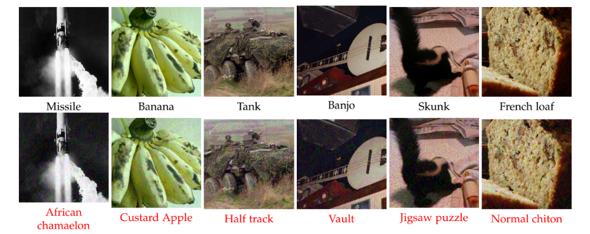

# GD-UAP for Classification

Code for the paper [Generalizable Data-free Objective for Crafting Universal Adversarial Perturbations](https://arxiv.org/abs/1801.08092)

Mopuri Konda Reddy*,Aditya Ganeshan*, R. Venkatesh Babu

###### * = equal contribution 

This section contains code to craft and evaluate GD-UAP on the task of classification using Tensorflow.

## Precomputed Perturbations

Perturbations crafted using the proposed algorithm are provided in this [link](https://www.dropbox.com/s/ixjzg4itx10nhid/perturbations.tar.gz?dl=0). After extracting them, and placing them in the respective folders (In each task), you can use the evaluation code provided in each task for evaluation.

## Usage Instructions

### 1) Preparation

For training and evaluation, the following steps must be followed:

1) Download the ILSVRC dataset, for testing and training, and Pascal VOC 2012 dataset for the validation. Kindly look [here](http://www.image-net.org/challenges/LSVRC/) and [here](http://host.robots.ox.ac.uk/pascal/VOC/voc2012/) for these datasets respectively.

2) Now, make four files, `ilsvrc_train.txt`, `ilsvrc_test.txt`, `ilsvrc_gt.txt` and `pascal_val.txt`, containing the list of the training images, testing images, testing ground truth, and validation images respectively (an example is provided in `utils/` folder).

3) Use scripts `make_gaussian_noise.py`, `make_preprocessed_data.py` provided in `data/` to make the gaussian sample (for range prior training) and the validation set.

4) Download the weights of the 6 networks using the script `download_weights.sh` in `weights/` folder.

5) ** For only evaluation: ** Follow steps 1,2 and 4. Download and save the precomputed perturbations from this [link](https://www.dropbox.com/s/ixjzg4itx10nhid/perturbations.tar.gz?dl=0), and save the classification perturbations in the `perturbations/` folder.

### 2) Training

To train a perturbation you can use the `train.py` script. For example to train/craft a perturbation for `googlenet`, with data priors, use the following command:

```
python train.py --network googlenet --prior_type with_data --img_list utils/ilsvrc_train.txt --batch_size 20
```
This will run an optimization process proposed in the paper to craft a UAP for `googlenet` with data-priors. The resultant perturbation is saved in `perturbations/`.


### 3) Testing

To evaluate the performance of a perturbation on the ILSVRC test dataset, you can use the `evaluate.py` script. For example, to test the fooling performance of the perturbation `perturbations/googlenet_with_range.npy` on `googlenet` architecture, use the following command:

```
python evaluate.py --network googlenet --adv_im perturbations/googlenet_with_range.npy --img_list utils/ilsvrc_test.txt --gt_list ilsvrc_gt.txt --batch_size 20
```
This command will print the normal accuracy, perturbed accuracy and the fooling rate after each 100 iterations, and give the final results (on the whole test dataset) at the end.

## Results

These are some results taken from the paper:

### Quantitative Results

|Model     | Baseline | No prior | Range prior | Data prior | FFF | UAP|
|------------|-----|-----|-----|-----|-----|-----|
|CaffeNet     | 12.9 | 84.88    | 87.02       | 91.54   | 80.92   | **93.1**   |
|VGG-F        | 12.62 | 85.96    | 91.81       | 92.64   | 81.59  | **93.8**   |
|Googlenet    | 10.29 | 58.62    | 71.44       | **83.54**   | 56.44  | 78.5   |
|VGG-16       | 8.62 | 45.47    | 63.08       | 77.77   | 47.10  | **77.8**   |
|VGG-19       | 8.40 | 40.68    | 64.67       | 75.51   | 43.62  | **80.8**   |
|Resnet-152   | 8.99 | 29.78    | 37.3        | 66.68   |  - | **84.0**   | 

## Acknowledgement

Without the following works, this work would not have been possible. We whole-heartedly acknowledge the contribution from the following:

* [Fast Feature Fool](https://github.com/val-iisc/fast-feature-fool), and Universal Adversarial Perturbations(https://github.com/LTS4/universal). 

* [PASCAL](http://host.robots.ox.ac.uk/pascal/VOC/voc2012/) and [ILSVRC](http://www.image-net.org/challenges/LSVRC/).

* [Tensorflow Classification](https://github.com/utsavgarg/tensorflow-classification).
