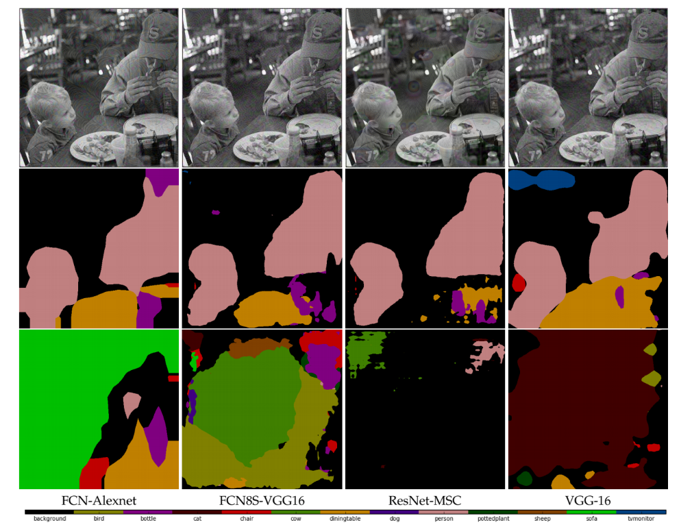

# GD-UAP for Segmentation

Code for the paper [Generalizable Data-free Objective for Crafting Universal Adversarial Perturbations](https://arxiv.org/abs/1801.08092)

Mopuri Konda Reddy*,Aditya Ganeshan*, R. Venkatesh Babu

###### * = equal contribution  

This section contains code to craft and evaluate GD-UAP on the task of segmentation using Pytorch.

## Precomputed Perturbations

Perturbations crafted using the proposed algorithm are provided in this [link](https://www.dropbox.com/s/ixjzg4itx10nhid/perturbations.tar.gz?dl=0). After extracting them, and placing them in the respective folders (In each task), you can use the evaluation code provided in each task for evaluation.

## Usage Instructions

### 1) Preparation

For training and evaluation, the following steps must be followed: 

1) Download the Pascal VOC 2012 dataset, for testing and training, and  ILSVRC dataset for the validation. Kindly look [here](http://host.robots.ox.ac.uk/pascal/VOC/voc2012/) and [here](http://www.image-net.org/challenges/LSVRC/) for these datasets respectively.

2) Now, make four files, `pascal_train.txt`, `pascal_train_partial.txt`, `pascal_test.txt` (taken from [fcn.berkeleyvision.org](https://github.com/shelhamer/fcn.berkeleyvision.org)) and `ilsvrc_val.txt`, containing the list of the all training images,partial training images (for more details, kindly read paper), testing images, and validation images respectively (an example is provided in `utils/` folder).

3) Use scripts `make_gaussian_noise.py`, `make_preprocessed_data.py` provided in `data/` to make the gaussian sample (for range prior training) and the validation set.

4) Download the weights of the `Deeplab Resnet101 Multi-scale` network using the script `download_weights.sh` provided in `weights/` folder. For the other 3 networks, use this [link](https://www.dropbox.com/s/hjmdi9k3skyjfjb/additional_weights.tar.gz?dl=0) to download a compressed version of weights (for, `FCN Alexnet`,`FCN 8s VGG16`, and `Deeplab Large-FOV VGG16`).

5) Kindly look into [seg_metrics_pytorch](https://github.com/BardOfCodes/seg_metrics_pytorch) for details regarding the metric evaluation scripts.

5) ** For only evaluation: ** Follow steps 1,2,4 and 5. Download and save the precomputed perturbations from this [link](https://www.dropbox.com/s/ixjzg4itx10nhid/perturbations.tar.gz?dl=0), and save the segmentation perturbations in the `perturbations/` folder.

### 2) Training

To train a perturbation you can use the `train.py` script. For example to train/craft a perturbation for `Deeplab Large-FOV VGG 16`, with data priors, use the following command:

```
python train.py --network dl_vgg16 --prior_type with_data --im_list utils/ilsvrc_train.txt --train_batch_size 10 --val_batch_size 15 --im_path /data1/data/pasvalVOC/pascalVOC2012/ --gpu 0
```

This will run an optimization process proposed in the paper to craft a UAP for `Deeplab Large-FOV VGG 16` with data-priors. The resultant perturbation is saved in `perturbations/`.


### 3) Testing

Evaluating the performance of a perturbation on the PASCAL val dataset is a two step process. First, you can use the `get_outputs.py` script.This will save the predicted segmentation maps for normal and perturbed images as `.png` files. For example, to get the output of the perturbation `perturbations/dl_vgg_with_data.npy` on `Deeplab Large-FOV VGG 16` architecture, use the following command:

```
python get_outputs.py --network dl_vgg16 --adv_im perturbations/dl_vgg_with_data.npy --im_list utils/pascal_test.txt --save_path output/ --gpu 0 
```

This command will save the predicted segmentation maps for normal and perturbed images at `output/normal_predictions/` and `output/perturbed_predictions/` respectively.

To find the Fooling rate and other metrics from the output, we are using [seg_metrics_pytorch](https://github.com/BardOfCodes/seg_metrics_pytorch). After the previous step, to find the mIOU of perturbed prediction w.r.t. normal prediction (which can then be used to find the fooling rate), use the `seg_metrics/demo.py` script as follows:

```
cd seg_metrics
python demo.py find_metrics ../output/perturbed_predictions/ ../output/normal_predictions/ ../utils/pascal_test.txt --gpu 0
```

## Results

These are some results taken from the paper:

### Quantitative Results

**  Kindly read the paper to understand the results presented.**

|Model     | Original | Baseline | No Data | Range prior | All data | Data w/less BG |ICCV 2017 |
|------------|-----|-----|-----|-----|-----|-----|-----|
|FCN-Alex    | 46.21 | 45.72    |15.35 |10.37 |10.64 |8.03  |3.98 |
|FCN-8s-VGG  | 65.49 | 64.34    |42.78 |39.08 |33.61 |28.05 |4.02 |
|DL-VGG      | 62.10 | 61.13    |36.91 |35.41 |44.90 |27.41 |43.96|
|VGGDL_RN101 | 74.94 | 73.42    |56.40 |58.66 |37.45 |39.00 |73.01|


## Acknowledgement

Without the following works, this work would not have been possible. We whole-heartedly acknowledge the contribution from the following:

* Works related to FCN: [pytorch-fcn](https://github.com/wkentaro/pytorch-fcn), [fcn.berkeleyvision.org](https://github.com/shelhamer/fcn.berkeleyvision.org).

* Works related to Deeplab: [pytorch-deeplab-resnet](https://github.com/isht7/pytorch-deeplab-resnet) and [pytorch_deeplab_large_fov](https://github.com/BardOfCodes/pytorch_deeplab_large_fov).

* Dataset: [PASCAL](http://host.robots.ox.ac.uk/pascal/VOC/voc2012/) and [ILSVRC](http://www.image-net.org/challenges/LSVRC/).

* Evaluation Scripts: [seg_metrics_pytorch](https://github.com/BardOfCodes/seg_metrics_pytorch).


